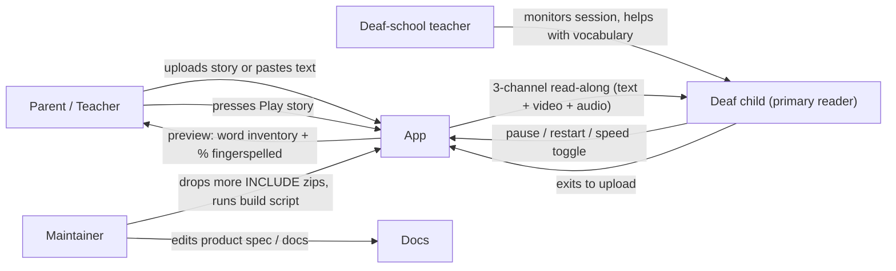

# Kahani — Presentation Draft

> Slide-by-slide content for a ~12-15 slide presentation. Each slide
> has a title and the speaker-facing bullets / diagram descriptions. The
> flowcharts and use-case diagram are described in ASCII / Mermaid so
> they can be lifted into PowerPoint / Keynote / Google Slides.

---

## Slide 1 — Title slide

**Title**: Kahani — Story Time with Signs
**Subtitle**: A synchronized ISL read-along experience for hearing-impaired children
**Authors**: [Your name], [year]
**Course / venue**: [your course code / lab]
**One-line tagline**: Upload any children's story; the browser reads it aloud while real Indian Sign Language videos play word-by-word — and letter-by-letter fingerspelling covers everything else.

---

## Slide 2 — Outline

1. Introduction
2. Motivation
3. Literature survey
4. Objectives
5. Proposed plan of work (architecture diagram, use cases)
6. Technology
7. Expected outcome
8. References

---

## Slide 3 — Introduction

**Audience**: hearing-impaired children (ages 4–10) learning to read with sign support.

**The problem we address**:

- Children's stories are abundant in print (.txt, .pdf, .docx) but inaccessible to deaf children without a human signer.
- Existing ISL learning apps focus on vocabulary drills, not narrative playback.
- A typical home or classroom has no access to a live ISL interpreter for ad-hoc story time.

**The product**: Kahani (Hindi for "story") turns any uploaded story into a three-channel synchronized read-along:

1. **Text** — story scrolls word by word; current word is highlighted.
2. **Video** — a real ISL sign video plays for that word.
3. **Audio** — the browser's text-to-speech engine reads the story aloud.

**Fallback**: when the dictionary has no entry for a word, the UI plays **letter-by-letter fingerspelling** (real ISL alphabet / digit signs) so the child never sees a blank screen.

---

## Slide 4 — Motivation

**Why this matters**:

- **Literacy through sign**: deaf children often have weaker print-literacy exposure because storytime is mediated by an interpreter; a self-service reader closes that gap.
- **Classroom reality**: many Indian deaf schools have one interpreter for 30+ students; a digital narrator lets the teacher focus on instruction.
- **Open and offline**: runs entirely in the browser. No accounts, no cloud, no analytics. Privacy-respecting by construction.

**Why it has to be in the browser**:

- No install barrier for parents / teachers.
- Web Speech API gives free TTS without per-minute costs.
- Static video clips served by the same backend — works on a school laptop, a tablet, even a phone.

**What we are NOT building** (scope discipline):

- Real-time ISL recognition from the webcam (rejected — out of scope, error-prone with kids).
- Multi-language input (deferred).
- Auth / cloud / mobile-app (overkill for a prototype).

---

## Slide 5 — Literature / related work

**Sign-language learning apps** (broad strokes):

- **ISL Dictionary apps** — vocabulary look-up, sign video per word; no narrative playback. Example families: Indian Sign Language apps on Play Store.
- **Storybook apps with sign** — typically curated content, not arbitrary input (e.g., signed story videos for deaf children, but locked to specific titles).
- **Signing avatars (SiGML / hamnosys)** — procedural 3D avatar signing. We rejected this — the rebuild prioritizes real video over avatar rendering.

**Speech-driven sync in the browser**:

- Web Speech API's `SpeechSynthesisUtterance` exposes `onboundary(charIndex)` events; many demos (e.g., karaoke-style lyric sync) use this for word-level timing.
- Safari fires `onboundary` only at sentence boundaries, not per word — documented browser inconsistency we worked around.

**Datasets we draw on**:

- **INCLUDE** (Sridhar et al., ACM MM 2020, Zenodo 4010759, CC-BY-4.0) — large-scale Indian Sign Language video dataset; we use a 22-word subset for whole-word signs.
- **Hemg/Indian_sign_language_dataset** (HuggingFace) — 35-class still-image dataset of ISL alphabet and digits; we encode one image per class as a 320×320 / 0.6 s looped MP4 for the fingerspelling fallback.

**Our contribution / what is novel here** (modest):

- Combining arbitrary text input (no curated content) with synchronized ISL playback + fingerspelling fallback in a single browser-based app.
- Per-unit utterance scheduling that survives same-clip and short-utterance failure modes in browser TTS engines.

---

## Slide 6 — Objectives

Primary objectives:

1. **Accept any story** — `.txt`, `.pdf`, `.docx`, or raw text.
2. **Tokenize to a per-word timeline** using spaCy (tokenize + lemmatize only; no reordering, no parsing) so the UI can address each word in source order.
3. **Look up each token** against a sign-video dictionary; for misses, fall back to fingerspelling.
4. **Synchronize three channels** — text highlight, sign video, audio narration — to a single timeline.
5. **Run entirely client-server in two processes** — FastAPI backend (port 3002) + Vite/React frontend (port 5173), no third-party services.

Secondary objectives / non-functional:

- Kid-friendly UI: pastel palette, rounded shapes, bunny mascot, ≥56 px tap targets, ≥28 px readable text.
- Privacy by default: no auth, no cloud, no persistence of uploaded stories.
- Extensibility: dropping more INCLUDE clips into `static/signs/` and rebuilding `signs/dictionary.json` instantly adds dictionary words; the build script for the Hemg fingerspelling fallback is one-shot and idempotent.

---

## Slide 7 — Architecture diagram

Diagram: end-to-end pipeline from upload to to playback to output.

```
  ┌────────────────────┐
  │ Browser (React)   │
  │ ┌────────────────┐ │
  │ │ Upload screen  │ │  user picks .txt / .pdf / .docx OR pastes text
  │ └───────┬────────┘ │
  │         │          │
  │ ┌───────▼────────┐ │
  │ │ Preview screen │ │  word inventory, % fingerspelled
  │ └───────┬────────┘ │
  │         │          │
  │ ┌───────▼────────┐ │
  │ │ Playback screen│ │  text + video + audio in sync
  │ └────────────────┘ │
  └─────────┬──────────┘
            │ HTTP
            ▼
  ┌────────────────────┐
  │ FastAPI            │  python3 -m venv .venv + uvicorn
  │ POST /api/upload   │  multipart file → spaCy → token list
  │ POST /api/tokenize │  raw text   → spaCy → token list
  │ GET  /api/signs/X  │  dictionary lookup
  │ GET  /static/signs/...   │  serves curated MP4s
  └─────────┬──────────┘
            │
            ▼
  ┌────────────────────┐
  │ Data on disk       │
  │ signs/dictionary.json         22 INCLUDE lemmas
  │ static/signs/<lemma>.mp4      INCLUDE whole-word clips
  │ static/signs/_letters/*.mp4   Hemg alphabet clips  (a-z)
  │ static/signs/_digits/*.mp4    Hemg digit clips      (1-9)
  └────────────────────┘
```

---

## Slide 8 — Use case diagram

Mermaid source (render in mermaid.live or paste into PPT-compatible markdown renderer):



Three actor groups:

- **Parent / teacher** (primary operator): uploads, previews, presses Play.
- **Deaf child** (primary reader): watches and listens; pause / restart / speed toggle during playback.
- **Admin / maintainer**: extends the dictionary by adding more INCLUDE clips to `static/signs/` and rebuilding `signs/dictionary.json`.

---

## Slide 9 — Sync model

Title: **One timer, three channels** — audio drives the timeline.

**Per-unit utterance scheduler** (one utterance per spoken unit):

- `spokenUnits[]` — one entry per unit. For sign-video words, surface = whole word. For fingerspelling words, surface = single letter / digit ("T", "H", "E", ...).
- `speakUnit(idx)` creates a `SpeechSynthesisUtterance(unit.surface)`, speaks it, and schedules a `setTimeout(UNIT_DURATION_MS = 1350)` to call `speakUnit(idx + 1)`.
- `onstart` sets `(activeIdx, activeLetter)` atomically — chip highlight, text highlight, and `<video>` src all update in lockstep.
- After the last unit, a `setTimeout(POST_ROLL_MS = 700)` holds the final state so short stories don't cut off mid-gesture.

Diagram:

```
  speakUnit(0)            speakUnit(1)            speakUnit(N)
       │                       │                       │
   speak("T")  ───1350ms───►  speak("H")  ───1350ms───► ...
   setActive(0)               setActive(0)
   video.src=t.mp4            video.src=h.mp4
                                                       │
                                                       ▼
                                                setTimeout(700ms)
                                                       │
                                                       ▼
                                                  reset to upload
```

**Why not use audio / video events for advance?**

- `SpeechSynthesisUtterance.onend` is unreliable — Chrome fires it, Safari sometimes doesn't, especially for very short utterances.
- `<video>.onEnded>` is unreliable for same-clip repeated units and short clips.
- A `setTimeout` is deterministic, browser-agnostic, and never gets stuck.

---

## Slide 10 — Technology stack

| Layer | Tech | Why |
|---|---|---|
| Backend | Python 3.12, FastAPI 0.115, uvicorn | Async-friendly, fast, OpenAPI built-in |
| NLP | spaCy 3.8 + `en_core_web_sm` | Tokenize + lemmatize only; no parser / tagger / NER |
| File parsing | pypdf 5.1, python-docx 1.1 | Industry-standard, no system deps |
| Validation | pydantic 2.10 | Type-safe request / response |
| Frontend | React 19, Vite 8 | Fast HMR, no build step in dev |
| Sync | Web Speech API + `setTimeout` | Per-unit utterances; audio drives the timeline |
| Typography | Fredoka + Quicksand (Google Fonts) | Rounded friendly sans |
| Mascot | Inline SVG | No asset deps, scales with the UI |
| Data — words | INCLUDE (Zenodo 4010759, CC-BY-4.0) | Real ISL video, openly licensed |
| Data — letters / digits | Hemg/Indian_sign_language_dataset (HuggingFace) | Still images of ISL alphabet + digits |
| Build tools | pyarrow (parquet reader), imageio + ffmpeg (MP4 writer), Pillow (image padding) | One-shot build script for Hemg clips |

---

## Slide 11 — Expected outcomes

Deliverables:

- A working `localhost:3002` (FastAPI) + `localhost:5173` (Vite) deployment that accepts `.txt`, `.pdf`, `.docx`, or pasted text and returns a synchronized ISL read-along.
- 22 INCLUDE dictionary entries covering animals, days/time, greetings, pronouns, and seasons (partial INCLUDE download — expandable).
- 26 Hemg alphabet clips + 9 Hemg digit clips (real ISL hand signs) used for the fingerspelling fallback.
- ~12–15 s story playthrough for a typical 6-word sample sentence (10 units × 1350 ms + 700 ms post-roll).

Quantitative / qualitative expectations:

- All three channels (text, audio, video) update within the same 1.35 s stage-time window of each spoken unit — no observable drift between audio and video.
- Per-character chips highlight sequentially for fingerspell words, with letter vs digit visually distinct (yellow vs cyan).
- Every word in the story produces *some* visual: a sign video or a fingerspelling sequence. No blank screens.
- The app passes its linter (oxlint) and production build (vite build) with zero warnings.

Stretch / future work (not in this prototype):

- More INCLUDE halves (`Animals_1of2`, `Greetings_1of2`, `Colours_1of2`, `Pronouns_1of2`, `Days_and_Time_1of3+2of3`) would push the dictionary to ~100–150 entries.
- Replace placeholder fingerspelling clips with curated real ISL alphabet footage — already done with Hemg, but quality could improve with a higher-resolution source.
- Safari onstart / onend reliability fixes (pre-computed timestamps) so word-by-word sync is identical across browsers.

---

## Slide 12 — Demo flow (live or screenshot)

Walk-through script:

1. Open `http://localhost:5173/` → upload screen with bunny mascot.
2. Click **Paste text** → paste `"the horse ran in 2024 morning."` → press **Read to me!** → preview screen shows 6 words: 3 fingerspell + 2 sign-video + 1 fingerspell-with-digits.
3. Press **▶ Play story** → playback screen:
   - Text scrolls, "the" highlighted while letters T, H, E play in sequence (yellow chips).
   - "horse" highlighted while horse.mp4 plays for 1.35 s.
   - "ran", "in" highlighted, fingerspell R-A-N, A-T (yellow chips).
   - "2024" highlighted while digits 2-0-2-4 play in sequence (cyan chips).
   - "morning" highlighted while morning.mp4 plays.
4. After 0.7 s post-roll hold, the screen resets to upload.

---

## Slide 13 — References

1. A. Sridhar, R. G. Ganesan, P. Kumar, M. M. Khapra. *INCLUDE: A Large Scale Dataset for Indian Sign Language Recognition.* ACM Multimedia 2020. DOI: [10.1145/3394171.3413528](https://doi.org/10.1145/3394171.3413528). Dataset: [Zenodo 4010759](https://zenodo.org/records/4010759). License: CC-BY-4.0.

2. *Hemg/Indian_sign_language_dataset.* HuggingFace Datasets. [huggingface.co/datasets/Hemg/Indian_sign_language_dataset](https://huggingface.co/datasets/Hemg/Indian_sign_language_dataset). 42,745 images, 35 classes (digits 1–9 + letters A–Z).

3. M. Honnibal, I. Montani. *spaCy 2: Natural language understanding with Bloom embeddings, convolutional neural networks and incremental parsing.* To appear (2017). [spacy.io](https://spacy.io).

4. *Web Speech API — SpeechSynthesisUtterance.* MDN Web Docs. [developer.mozilla.org/en-US/docs/Web/API/SpeechSynthesisUtterance](https://developer.mozilla.org/en-US/docs/Web/API/SpeechSynthesisUtterance).

5. *FastAPI.* [fastapi.tiangolo.com](https://fastapi.tiangolo.com).

6. *Vite — Next Generation Frontend Tooling.* [vitejs.dev](https://vitejs.dev).

7. *React.* [react.dev](https://react.dev).

8. *Creative Commons Attribution 4.0 International (CC-BY-4.0).* [creativecommons.org/licenses/by/4.0/](https://creativecommons.org/licenses/by/4.0/).

---

## Appendix — slide-rendering notes

- For Slides 7 and 9, lift the ASCII art into a tool like [mermaid.live](https://mermaid.live) (Slides 7 and 9 also have Mermaid in the use-case diagram), or draw in PowerPoint.
- For Slide 5, the literature survey is intentionally light because the project's IP is mostly its own implementation; if your course expects more references, add ones specific to Indian Sign Language processing (e.g., Wadhawan & Kumar 2019, Sridhar 2018).
- For Slide 11, "stretch / future work" is intentionally separated from the deliverables so you don't get docked for overpromising.