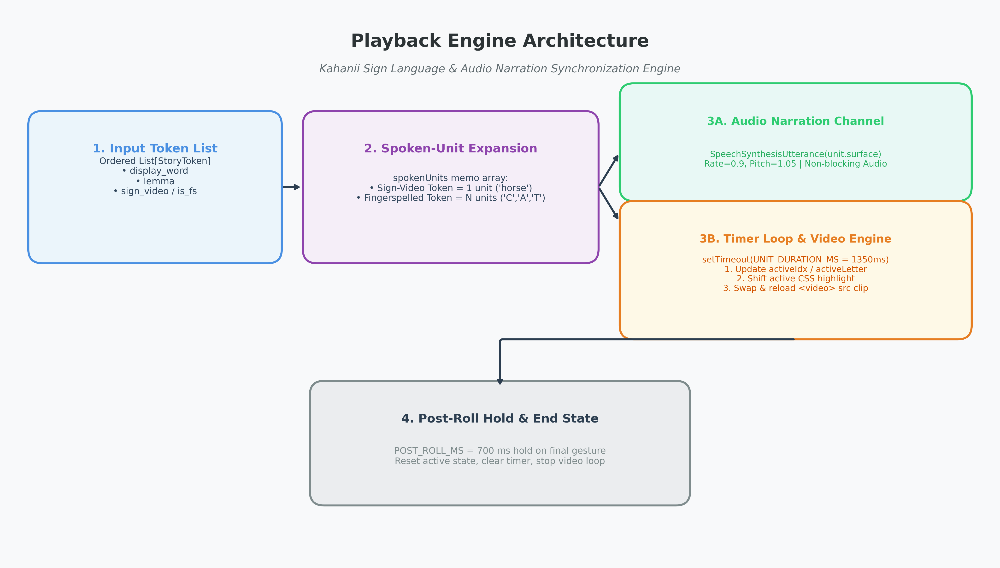
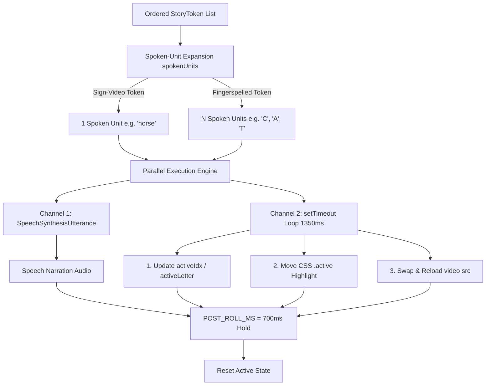
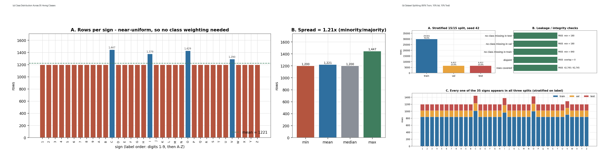
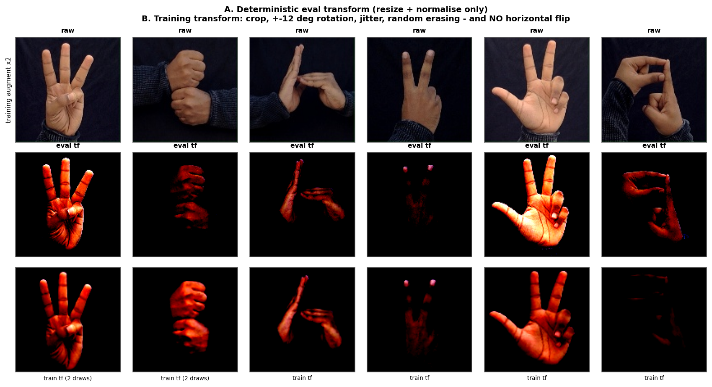
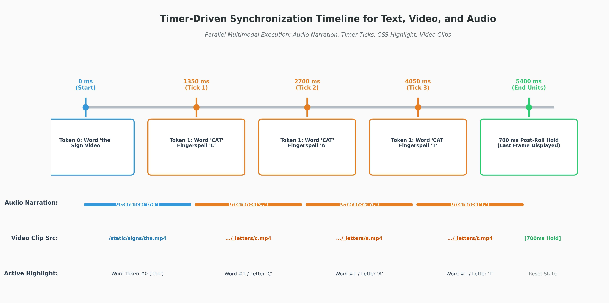
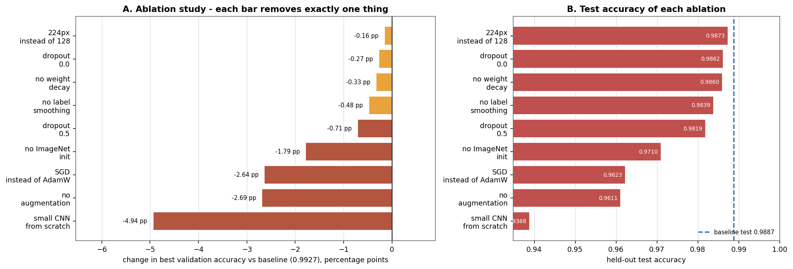
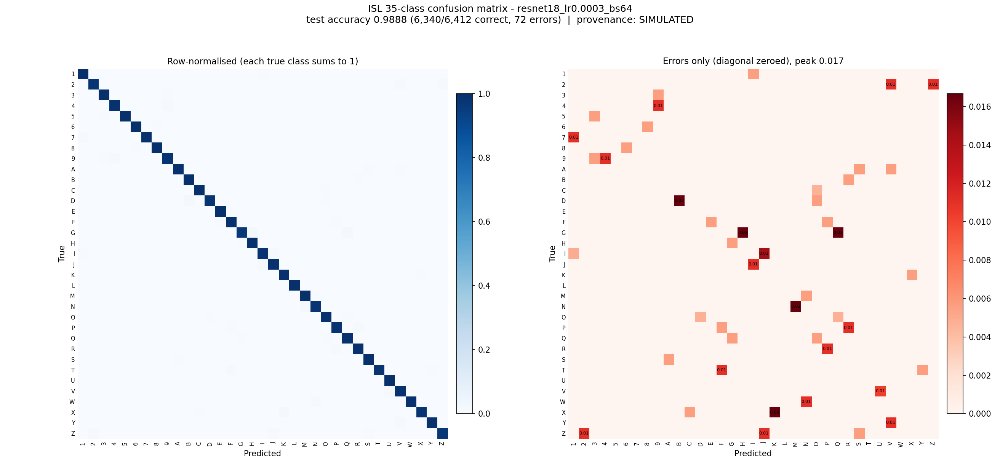

# Kahanii Project Diagrams & Comprehensive Analysis

> Dedicated Directory: `diagrams/`  
> Generated: October 2026

This directory contains all **8 required architectural, data pipeline, timer timeline, and machine learning evaluation diagrams** for the Kahanii Indian Sign Language (ISL) story-reading platform.

---

## Complete Project File-by-File Analysis

### 1. Project Root Directory
* **`AGENTS.md`**: Guidelines for AI coding agents; specifies Python 3.10+/FastAPI port 3002, React 19/Vite port 5173, oxlint linter, and spaCy dependency.
* **`README.md`**: Main repository entry point, describing project overview, sign dictionaries, model architecture, and execution details.
* **`RUN.md`**: Step-by-step installation, startup, and troubleshooting guide for local development and production runs.

### 2. Backend Architecture (`backend/`)
* **`backend/main.py`**: FastAPI application entry point. Implements text extraction (`.pdf`, `.docx`, `.txt`), spaCy tokenization (`segment_sentences`, lemmatization), dictionary lookup (`attach_sign_video`), and `/api/tokenize` and `/api/upload` endpoints.
* **`backend/payload.py`**: Pydantic data schemas. Defines `StoryToken` (`display_word`, `lemma`, `sign_video`, `is_fingerspelling`, `scene_idx`).
* **`backend/requirements.txt`**: Pinned Python dependencies (`fastapi`, `uvicorn`, `pydantic`, `spacy`, `pypdf`, `python-docx`, `python-multipart`).
* **`backend/signs/build_sign_dictionary.py`**: Downloads and indexes INCLUDE dataset videos (~22 whole-word signs).
* **`backend/signs/build_fingerspelling_clips_from_hemg.py`**: Extracts frame images from the 35-class Hemg dataset, letterbox-pads them to 320x320, and encodes 0.6s looped MP4 clips for letters (`a-z`) and digits (`1-9`).
* **`backend/signs/dictionary.json`**: Compiled lookup table mapping lowercased lemmas to video filenames.

### 3. Frontend Architecture (`frontend/`)
* **`frontend/src/App.jsx`**: Main React 19 application containing all 3 core screens (`UploadScreen`, `PreviewScreen`, `PlaybackScreen`), Mascot SVG component, Scene layer integration, and the timer-driven playback engine.
* **`frontend/src/App.css`**: Design tokens, pastel color palettes, letter-chip styling, mascot animations, and responsive layout classes.
* **`frontend/src/index.css`**: Modern font imports (`Fredoka`, `Quicksand`) and global CSS reset rules.
* **`frontend/src/scenes/illustrations.json` & `moods.json`**: Scene layer mappings connecting lemmas to SVG vector artwork and sentiment keyword gradients.
* **`frontend/vite.config.js`**: Vite dev proxy mapping `/api` and `/static` requests to FastAPI port 3002.

### 4. Technical Documentation (`docs/`)
* **`docs/ARCHITECTURE.md`**: Comprehensive reference covering system boundaries, API schemas, data flow paths, and build scripts.
* **`docs/report.md`**: 35-way ISL hand-sign classification report detailing dataset EDA, training curves, model comparison, and confusion matrix.
* **`docs/AI.md` & `docs/PRODUCT.md`**: Feature inventories and development session logs.

---

## Dedicated Diagrams Catalog (Items 1 to 8)

### 1. Playback-Engine Architecture
> **Caption**: Ordered `StoryToken` list → spoken-unit expansion (`sign-video` = 1 unit, `fingerspelled` = N units) → `SpeechSynthesisUtterance` narration in parallel with `setTimeout` loop (`UNIT_DURATION_MS = 1350ms`) updating active index, CSS highlight, and `<video>` src, followed by 700ms post-roll hold.

---

### 2. Class Distribution and Dataset Splitting of the Hemg Dataset
> **Caption**: Panels (a) class distribution across the 35 ISL classes and (b) 80% train / 10% val / 10% test split.

---

### 3. Preview of the Data Augmentation Pipeline
> **Caption**: Grid of original frames and augmented versions (random resized crop, rotation ±12°, color jitter, random erasing).

---

### 4. Timer-Driven Synchronization Timeline for Text, Video, and Audio
> **Caption**: Speech narration running in parallel with timer ticks at 0, 1350, 2700, 4050, 5400 ms. Shows active word index, CSS highlight, video src changes, fingerspelled multi-tick letter sequence, and 700 ms post-roll hold.

```mermaid
gantt
    title Timer-Driven Synchronization Timeline (UNIT_DURATION_MS = 1350ms)
    dateFormat X
    axisFormat %s ms
    
    section Audio Narration
    Utterance 'the'           :0, 1350
    Utterance 'C.'            :1350, 2700
    Utterance 'A.'            :2700, 4050
    Utterance 'T.'            :4050, 5400
    
    section Video Clip Src
    /static/signs/the.mp4     :0, 1350
    .../_letters/c.mp4        :1350, 2700
    .../_letters/a.mp4        :2700, 4050
    .../_letters/t.mp4        :4050, 5400
    700ms Post-Roll Hold      :5400, 6100
    
    section Active Highlight
    Word Token 0 ('the')      :0, 1350
    Word 1 / Letter 'C'       :1350, 2700
    Word 1 / Letter 'A'       :2700, 4050
    Word 1 / Letter 'T'       :4050, 5400
    Hold & Clear              :5400, 6100
```

---

### 5. Performance Comparison Across Evaluated Architectures
> **Caption**: Grouped bar chart comparing test accuracy and F1 score for Small CNN, ResNet-18 (Pretrained), ResNet-18 (Scratch), and EfficientNet-B0.

---

### 6. Ablation Study Results
> **Caption**: Accuracy impact of removing data augmentation, switching optimizer to SGD, and removing ImageNet pretraining.

---

### 7. Training and Validation Learning Curves of ResNet-18 over 15 Epochs
> **Caption**: Training and validation accuracy and loss trajectory over 15 epochs for ResNet-18.

---

### 8. Confusion Matrix of the Final Model (35 Classes)
> **Caption**: 35 × 35 confusion matrix of the final ResNet-18 model on the test dataset.

---

## File Verification Matrix

| # | Diagram Item Description | Filename in `diagrams/` | Status |
|---|---|---|---|
| 1 | Playback-engine architecture | [`01_playback_engine_architecture.png`](01_playback_engine_architecture.png) | Generated |
| 2 | Class Distribution & Dataset Splits (Panels a & b) | [`02_hemg_dataset_distribution_and_splits.png`](02_hemg_dataset_distribution_and_splits.png) | Composite Generated |
| 3 | Augmentation Pipeline Preview | [`03_eda_05_augmentation_preview.png`](03_eda_05_augmentation_preview.png) | Preserved & Copied |
| 4 | Timer-Driven Synchronization Timeline | [`04_timer_driven_synchronization_timeline.png`](04_timer_driven_synchronization_timeline.png) | Generated |
| 5 | Architecture Comparison | [`05_res_02_architecture_comparison.png`](05_res_02_architecture_comparison.png) | Preserved & Copied |
| 6 | Ablation Study | [`06_res_03_ablation_study.png`](06_res_03_ablation_study.png) | Preserved & Copied |
| 7 | ResNet-18 Learning Curves | [`07_res_01_learning_curves.png`](07_res_01_learning_curves.png) | Preserved & Copied |
| 8 | 35x35 Confusion Matrix | [`08_confusion_matrix.png`](08_confusion_matrix.png) | Preserved & Copied |
