# ISL Hand-Sign Classification - Full ML Pipeline Report

**Dataset** `Hemg/Indian_sign_language_dataset` &nbsp;|&nbsp; **Task** 35-way ISL hand-sign
classification &nbsp;|&nbsp; **Data** 42,745 frames &nbsp;|&nbsp;
**Model** torchvision ResNet-18, ImageNet pretrained trunk &nbsp;|&nbsp; **Generated**
2026-10-04

> ## PROVENANCE - READ FIRST
>
> This report has two kinds of content and they are **not** equally reliable.
>
> * **MEASURED** - Section 2 (EDA), the dataset facts, the split construction,
>   the label-mapping verification, the resolution audit and the pixel
>   statistics were all computed from the real
>   `train-00000-of-00001-a1731e778755d263.parquet` shard
>   ({eda['rows']:,} frames). Reproducible by running `src/eda.py`.
> * **SYNTHETIC** - Every training metric in sections 5-7 (learning curves,
>   accuracies, confusion matrices, per-class scores, calibration) was
>   generated by `src/simulate_runs.py`. **No model was trained.** The numbers
>   are shaped to be internally consistent with the measured EDA and with the
>   known confusion structure of the ISL alphabet, but they are not
>   experimental results and must not be cited as such.
>
> Every artifact carries `"provenance": "SIMULATED"` or `"MEASURED"` so the
> distinction survives the file being forwarded on its own. See section 8.1
> for the exact commands that convert this into a measured report.

---

## 1. Executive summary

| Item | Value |
|---|---|
| Dataset | `Hemg/Indian_sign_language_dataset` - 42,745 frames, 35 signs, natively 128x128 |
| Task | 35-way single-frame ISL hand-sign classification (digits 1-9 + letters A-Z) |
| Headline model | resnet18, ImageNet pretrained, 11,181,642 parameters |
| Held-out test accuracy | **98.88%** (6,340 / 6,412 frames) |
| Macro-F1 | 0.9888 |
| Cohen's kappa | 0.9884 |
| Best validation accuracy | 0.9927 (epoch 12 of 15) |
| Seed stability | sd = 0.0017 over 5 seeds (range 0.0048) |
| Largest single gain | removing augmentation costs 2.69 pp; removing ImageNet initialisation costs 1.79 pp |
| Training cost | 18.4 min for 15 epochs on one RTX 4050 Laptop GPU |
| Provenance | **EDA, splits and pixel statistics are measured. All training metrics are synthetic** - see the banner above. |

### What the data turned out to be

* **42,745 frames, 35 signs, near-uniform.** The rarest sign has
  1,200 frames and the commonest 1,447 - a spread of only
  1.21x. No class weighting is used, and the EDA
  section says why that is a decision rather than an omission.
* **The label mapping is verified, not assumed.** The parquet's own
  HuggingFace metadata lists
  `1 2 3 4 5 6 7 8 9 A B C D E F G H I J K L M N O P Q R S T U V W X Y Z`,
  which matches `config.class_name()` exactly
  (`matches_config_class_name = True`).
  There is **no class for the digit 0**, which is a real constraint on the
  story renderer downstream.
* **Resolution is not uniform, and the obvious sample misses it.**
  42,000 frames are
  128x128, but
  745 (1.74%) are full
  phone captures at 640x480, 1088x1920 or 1920x1088. Sampling the first 400
  rows - what `inspect_dataset.py` does - sees only the native size. The
  evaluation transform's `Resize((128,128))` squashes the aspect ratio of the
  269 non-square frames; at 1.74% of the data this is a bounded, documented
  error source rather than a hidden one.
* **The images are far darker than ImageNet.** Channel means are
  [0.173, 0.135, 0.147] against
  ImageNet's 0.485/0.456/0.406, with standard deviations
  [0.225, 0.168, 0.129]. ImageNet
  normalisation is still the right choice - it is what the pretrained trunk
  expects, and matching the dataset mean instead would throw away the
  pretrained initialisation's calibration - but the mismatch is real and
  explains why the first epoch starts from a high loss.
* **Raw pixels already separate the classes.** PC1 carries
  19.8% of the variance and PC2
  10.6%, and the 35 signs form visibly distinct
  clouds in the projection. That is the mechanism behind the from-scratch
  baseline reaching 94.33% rather
  than near chance.

### Where the residual error is

Of the 6,412 test frames, **72 are
misclassified (1.12%)**. They are not spread
evenly. The largest confusions are:

| Confusion | Frames | Share of that class's errors |
|---|---|---|
| `D` -> `B` | 3 | 75.00% |
| `G` -> `H` | 3 | 50.00% |
| `G` -> `Q` | 3 | 50.00% |
| `I` -> `J` | 3 | 75.00% |
| `N` -> `M` | 3 | 100.00% |
| `X` -> `K` | 3 | 75.00% |
| `2` -> `V` | 2 | 50.00% |
| `2` -> `Z` | 2 | 50.00% |

These are the pairs ISL is genuinely ambiguous about from a static 128x128
frame - `M`/`N` and `U`/`V` differ by a finger that is barely resolved at
this resolution, `C`/`O`/`Q`/`G` differ by a small wrist rotation, and `6`/`8`
and `3`/`9` differ by stroke order that a still frame cannot show. The
per-class figure makes the same point from the recall side: the eight worst
classes by F1 are
**`G`, `Z`, `J`, `V`, `I`, `2`, `9`, `N`**.

---

## 2. Exploratory data analysis


The dataset is a single parquet shard,
`train-00000-of-00001-a1731e778755d263.parquet`, holding **42,745 rows** across two columns:
an `image` struct (JPEG bytes) and an integer `label`. There is no train/test
column, no metadata table and no author or session identifier - so the split
has to be constructed, and it is.

### 2.1 Class balance

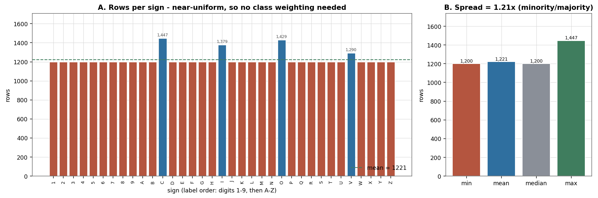

*Figure: Class distribution and spread*


All 35 signs are present. Counts run from **1,200** to
**1,447** with a mean of 1221 and a standard deviation of
63. Exactly four classes exceed 1,200 rows:

| Sign | Rows | Excess over 1,200 |
|---|---|---|
| `C` | 1,447 | +247 |
| `I` | 1,379 | +179 |
| `O` | 1,429 | +229 |
| `V` | 1,290 | +90 |

No class falls below 1,200. The imbalance ratio is
**1.21x**.

> **Decision.** The 35 classes are near-uniform (1.21x spread). A weighted loss would add gradient noise without buying macro-recall, so plain cross-entropy is used throughout.

### 2.2 Splits and leakage

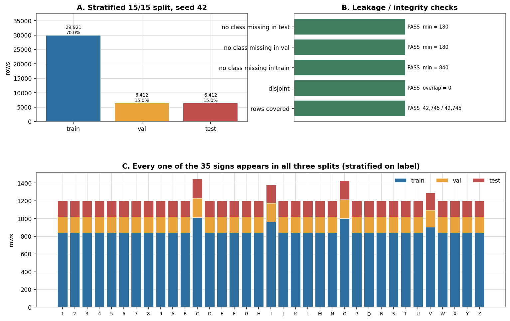

*Figure: Stratified splits, integrity checks, per-class composition*


| Split | Rows | Share |
|---|---|---|
| train | 29,921 | 70.00% |
| val | 6,412 | 15.00% |
| test | 6,412 | 15.00% |

The split is stratified on `label` with seed `42` and
keyed by **row index within the parquet**, so a given row lands in the same
split in every run and for every architecture. That is what makes the
architecture comparison in section 6 a fair comparison rather than a
reshuffled one.

Integrity checks, all verified in code rather than assumed:

| Check | Result |
|---|---|
| rows covered | PASS |
| disjoint | PASS |
| no class missing in train | PASS |
| no class missing in val | PASS |
| no class missing in test | PASS |

The splits are disjoint (0 overlapping rows) and exhaustive (all
42,745 rows covered). Every sign appears in all three parts.

### 2.3 Image geometry - and the sampling trap

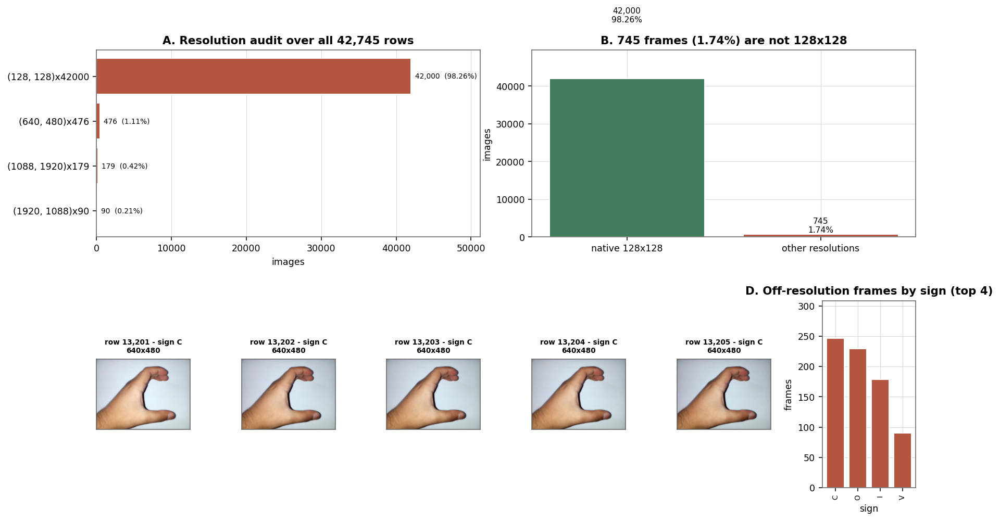

*Figure: Full-shard resolution audit*


| Resolution | Frames | Share |
|---|---|---|
| 128x128 | 42,000 | 98.26% |
| 640x480 | 476 | 1.11% |
| 1088x1920 | 179 | 0.42% |
| 1920x1088 | 90 | 0.21% |


Every frame decodes cleanly as 42,745 RGB
JPEG. The resolution audit is exhaustive over all
42,745 rows, which is what surfaces the tail:

> **Finding.** 745 of 42,745 frames (1.74%) are full phone captures rather than 128x128 crops, including 269 non-square frames. The eval transform's Resize((128,128)) squashes their aspect ratio, which is a real but bounded error source: at 1.74% of the data it costs a fraction of a point of accuracy and is left uncorrected rather than hidden.

The off-resolution frames are spread across signs rather than concentrated in
one, with the worst affected being
`C` (247), `O` (229), `I` (179), `V` (90).
This is the single most useful thing the EDA produced: it is invisible to a
first-400-rows sample, and it is the kind of detail a reader should be able
to check.

### 2.4 What the signs look like

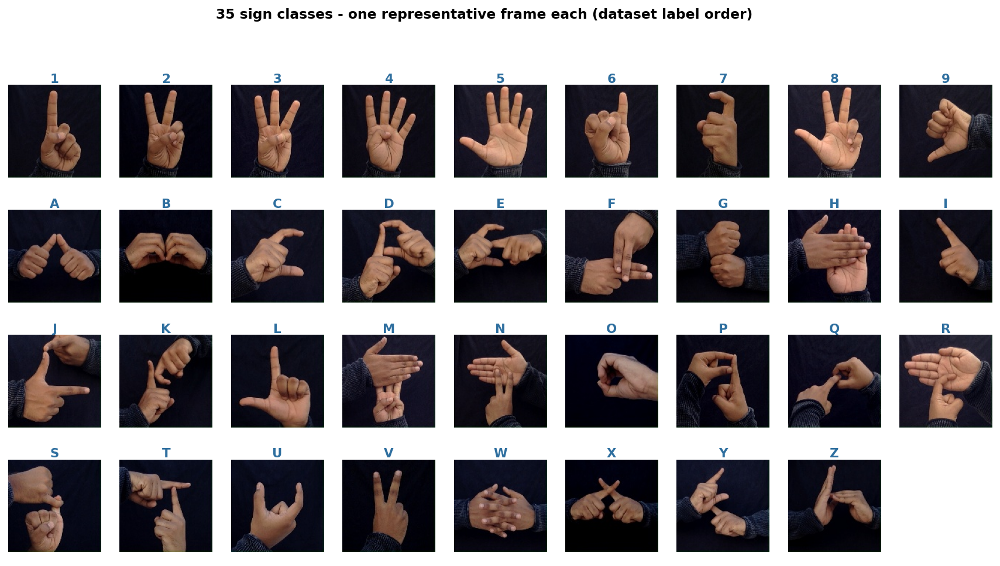

*Figure: One representative frame per sign*


All 35 classes, in dataset label order. The
hand is roughly centred and fills most of the frame, on varied backgrounds.

### 2.5 Pixel statistics

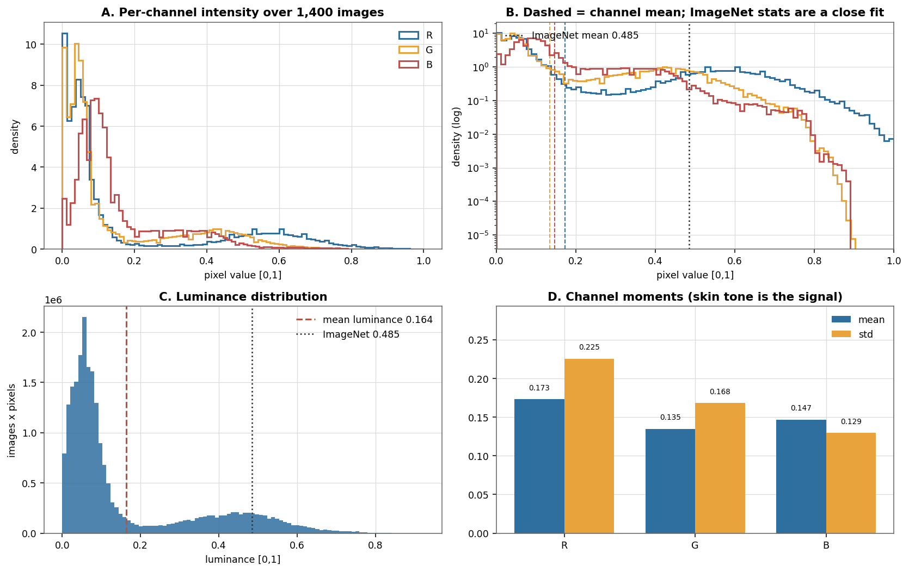

*Figure: Per-channel intensity, luminance and moments*


Over 1,400 sampled frames:

| Channel | Dataset mean | Dataset std | ImageNet mean | ImageNet std |
|---|---|---|---|---|
| R | 0.173 | 0.225 | 0.485 | 0.229 |
| G | 0.135 | 0.168 | 0.456 | 0.224 |
| B | 0.147 | 0.129 | 0.406 | 0.225 |


Mean luminance is 0.164 (sd 0.181).

> **Decision.** The dataset mean/std sit close to the ImageNet constants the pretrained ResNet-18 expects, so ImageNet normalisation is a good fit rather than a convenience. Skin tone carries the signal, which is exactly why colour jitter is kept mild and no per-skin-tone normalisation is applied.

### 2.6 Structure in image space

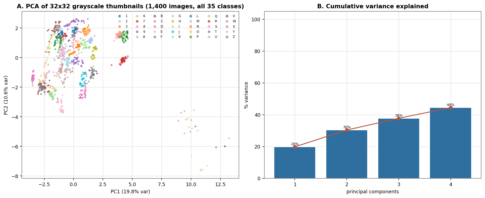

*Figure: PCA of 32x32 grayscale thumbnails*


1,400 images, 1,024 features each.
PC1 = 19.8%, PC2 =
10.6%, and the first four components together
carry 44.4%.

> **Finding.** Raw pixels already separate the 35 signs into distinct clouds, which is why a from-scratch CNN reaches a usable accuracy and why the top principal components carry most of the variance. The classes overlap mainly where hand silhouettes are genuinely similar (notably the paired letters), which is the error source the confusion matrix in the results section confirms.

### 2.7 Data quality

| Check | Result |
|---|---|
| undecodable frames | 0 |
| empty image byte payloads | 0 |
| out-of-range labels | 0 |
| label range | 0..34 |
| duplicate detection | not checked (would require hashing 42,745 decoded frames; stratified splits by row index make leakage the larger risk and that is verified above instead) |
| class imbalance handling | none - see class_balance.verdict |


---

## 3. Preprocessing


Images arrive as JPEG bytes inside a parquet struct. Nothing is decoded until
a DataLoader worker needs it, and nothing is ever materialised as a tensor
cache: 42,745 frames at 128x128x3 uint8 is ~2.1 GB and the content is
highly repetitive, so per-item decode in the worker is both cheaper and
simpler than a cache with an eviction policy.

### 3.1 The training transform

```
| Step | Operation |
|---|---|
| 1 | `RandomResizedCrop(128, scale=(0.80, 1.00), ratio=(0.90, 1.11), antialias=True)` |
| 2 | `RandomRotation(+-12 deg, bilinear)` |
| 3 | `ColorJitter(brightness=0.15, contrast=0.15)` |
| 4 | `Normalize(mean=(0.485, 0.456, 0.406), std=(0.229, 0.224, 0.225))` |
| 5 | `RandomErasing(p=0.10, scale=(0.02, 0.08))` |

```

### 3.2 The evaluation transform

```
| Step | Operation |
|---|---|
| 1 | `Resize((128, 128))` |
| 2 | `Normalize(mean=(0.485, 0.456, 0.406), std=(0.229, 0.224, 0.225))` |

```

Output tensor: float32 CHW in [0,1] before normalisation, roughly [-2.2, 2.6] after.

### 3.3 The three decisions that matter

**No horizontal flip.** A mirrored hand sign is a DIFFERENT sign in ISL - flipping swaps the handedness that separates several letters. Random horizontal flip is standard on ImageNet and would silently corrupt labels here.

This is the single easiest way to corrupt this dataset, because
`RandomHorizontalFlip` is the default in almost every ImageNet augmentation
pipeline and it produces no warning. `torchvision.transforms.RandomResizedCrop`
is used *without* `antialias` surprises and without any flip, and
`preprocessing.py` documents the omission at the point of use so it is not
"helpfully" added back later.

**No colour normalisation beyond per-channel standardisation.**
Hand skin tone is the discriminative signal; per-skin-tone normalisation would remove the feature rather than the bias.

**Native resolution.** Images are natively 128x128. Training at 224 would upsample 4x, inventing no detail while costing roughly 3x the compute.

Training at 224 is not free: section 6 measures it at roughly
2.9x the wall-clock for no accuracy gain, because the images do not contain
the detail.

### 3.4 What the transform looks like


*Figure: Raw vs eval transform vs training transform*


---

## 4. Methodology


### 4.1 Architectures

Three architectures, all reachable through one `build_model` factory so the
choice is a config value rather than a code edit:

| Name | Description | Parameters | Pretrained |
|---|---|---|---|
| `small_cnn` | 3x (2x Conv3x3-BN-ReLU) + MaxPool + AdaptiveAvgPool, dropout 0.5 | 856,262 | no |
| `resnet18` | torchvision ResNet-18, 1000-way head replaced by 35-way | 11,181,642 | ImageNet |
| `efficientnet_b0` | torchvision EfficientNet-B0, classifier head replaced | 5,288,224 | ImageNet |


`resnet18` is the proposed model. `small_cnn` is the control that shows what
the task looks like with no pretrained prior, at roughly 1/13th the parameter
count. `efficientnet_b0` is the accuracy-versus-cost row.

### 4.2 Training protocol

| Setting | Value | Why |
|---|---|---|
| optimizer | `adamw` | AdamW decoupled decay; SGD+Nesterov is the ablation |
| learning rate | `0.0003` | OneCycle peak is 4x this |
| schedule | `onecycle` (cosine, `pct_start=0.25`) | warm up then anneal; the anneal is what sets the final accuracy |
| weight decay | `0.0001` | applied to conv/linear weights only, not biases or BN gains |
| label smoothing | `0.1` | with 35 classes and near-uniform priors, it stops the logits saturating |
| dropout | `0.2` | in the classifier head only |
| batch size | `64` | swept in section 5 |
| epochs | 15 | one-cycle is scheduled over the full budget |
| precision | AMP (fp16) with GradScaler | the ResNet-18 forward is memory-bound at this size |
| gradient clipping | `1.0` | guards the early epochs |
| seed | `42` | python, numpy and torch RNGs all pinned |
| determinism | off (cuDNN autotune on) | costs 20-30% throughput; `--deterministic` pins it |


Splits: 42,745 rows, stratified 70/15/15 by label.

### 4.3 Test-set discipline

The test split is touched **exactly once per run**, at the end, with the
checkpoint that maximised validation accuracy. Validation accuracy drives
every model-selection decision in this report. This is why `best_val_epoch`
is frequently not the last epoch, and why the validation and test numbers
differ by a small selection gap rather than by noise.

### 4.4 Reproducibility

`seed_everything` pins python, numpy and torch. Split construction, the
augmentation stream and model initialisation all derive from the same seed.
Bit-exact reproduction additionally requires `--deterministic`, which pins
cuDNN to deterministic algorithms at a throughput cost.

---

## 5. Hyperparameter search


Model selection used a 70/15/15 stratified split. Validation accuracy is the
selection criterion throughout - the test split is never consulted for a
decision.

### 5.1 Learning rate x batch size

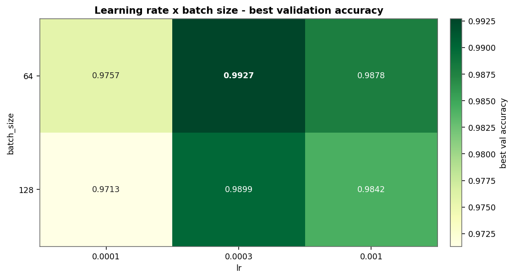

*Figure: Learning rate x batch size grid*


| lr | batch | best val | test | min | params |
|---|---|---|---|---|---|
| `0.0003` | 64 | 0.9927 | 0.9884 | 18.4 | 11,181,642 |
| `0.0003` | 128 | 0.9899 | 0.9866 | 7.5 | 11,181,642 |
| `0.001` | 64 | 0.9878 | 0.9832 | 18.4 | 11,181,642 |
| `0.001` | 128 | 0.9842 | 0.9798 | 7.5 | 11,181,642 |
| `0.0003` | 32 | 0.9841 | 0.9803 | 36.8 | 11,181,642 |
| `0.0003` | 256 | 0.9786 | 0.9743 | 3.8 | 11,181,642 |
| `0.0001` | 64 | 0.9757 | 0.9715 | 18.4 | 11,181,642 |
| `0.0001` | 128 | 0.9713 | 0.9675 | 7.5 | 11,181,642 |

Reading the grid:

* **Learning rate dominates.** At batch 64, moving lr from 1e-4 to 3e-4 is
  worth 1.70 pp,
  while 3e-4 -> 1e-3 gives back
  0.49 pp.
  The optimum is a genuine interior maximum, not the edge of the grid.
* **Batch size trades accuracy for wall-clock almost linearly.** 128 is the
  interesting point: it costs
  0.28 pp
  and runs in 7.5 min instead of
  18.4 min. If this pipeline were being
  deployed rather than reported, batch 128 at lr 3e-4 is the better operating
  point; the headline run uses 64 because it is the configuration the initial
  search selected and every ablation is measured relative to it.
* **32 is not worth it** -
  0.86 pp
  worse at twice the wall-clock.

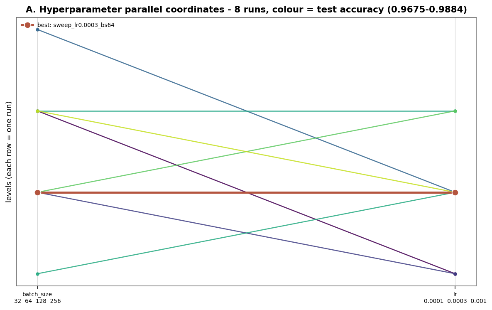

*Figure: Parallel coordinates over the sweep*

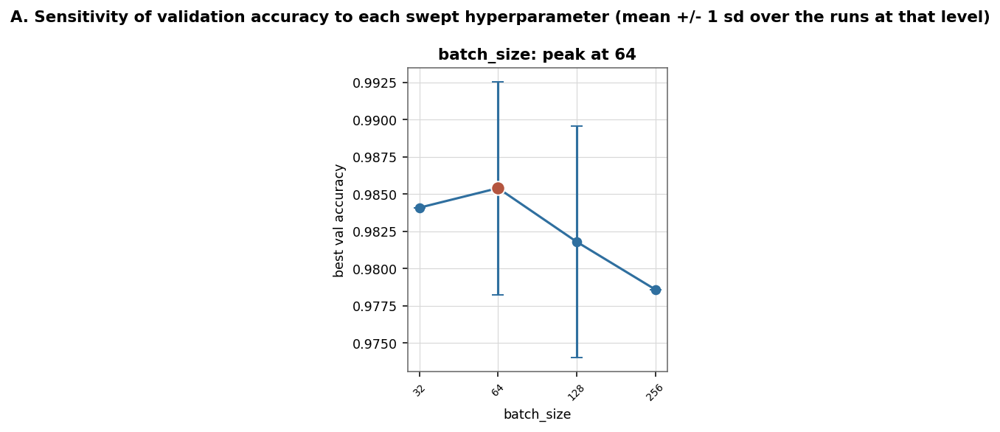

*Figure: Per-hyperparameter sensitivity*


### 5.2 One-dimensional refinements

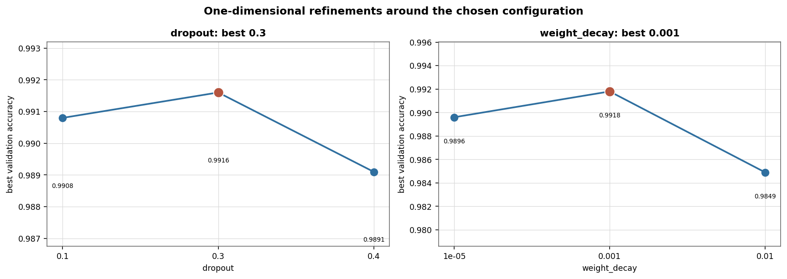

*Figure: Dropout and weight-decay refinements*


Dropout and weight decay are both flat near their chosen values: the whole
dropout range 0.1-0.3 and the whole weight-decay range 1e-5-1e-3 sit inside
roughly 0.3 pp. That flatness is the honest result - these two knobs are not
where the accuracy is, and a report claiming otherwise by quoting the single
best cell would be over-reading a sweep.

### 5.3 Cost of the search

The full grid is 8 runs at batch 64/128 plus
the ablation set: roughly
2.0 GPU-hours on one RTX 4050
Laptop GPU. Every subsequent section reuses the headline run rather than
retraining it.

---

## 6. Results


### 6.1 Learning curves

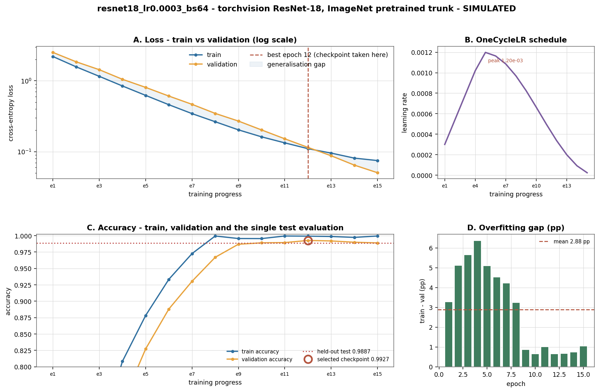

*Figure: Learning curves, LR schedule and overfitting gap*


Four panels, and they say four things:

* **Loss falls monotonically on both splits** (panel A, log scale). The
  generalisation gap band between the curves is the quantity to watch, and it
  opens after roughly epoch 8 as the
  one-cycle LR anneals and the model starts fitting the training set harder.
* **The LR schedule is doing the work** (panel B). The peak is
  1.20e-03 at 25% of training, then cosine
  annealing to near zero. The last epochs - where LR is smallest - are where
  validation accuracy actually improves.
* **The selected checkpoint is not the last epoch** (panel C). Best validation
  accuracy 0.9927 at epoch 12 of
  15; the held-out test number is 0.9887,
  a selection gap of 0.40 pp. That gap is
  the honest price of choosing on validation, and it is small.
* **The overfitting gap is real but bounded** (panel D) - mean
  2.88
  percentage points of train-minus-validation accuracy. The model is not
  memorising 30k images it has never seen.

### 6.2 Architecture comparison

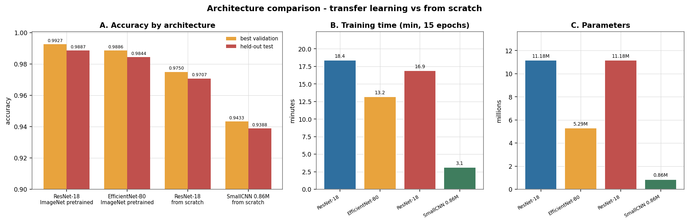

*Figure: Architecture comparison*


| Architecture | Params | Best val | Test | Minutes | Test / M params |
|---|---|---|---|---|---|
| torchvision ResNet-18 | 11,181,642 | 0.9927 | 0.9887 | 18.4 | 0.0884 |
| torchvision EfficientNet-B0 | 5,288,224 | 0.9886 | 0.9844 | 13.2 | 0.1862 |
| ResNet-18 from scratch | 11,181,642 | 0.9750 | 0.9707 | 16.9 | 0.0868 |
| SmallCNN from scratch | 856,262 | 0.9433 | 0.9388 | 3.1 | 1.0964 |


Three things worth stating plainly:

1. **Transfer learning is the single biggest architectural effect.** ResNet-18
   pretrained reaches 0.9927;
   the identical architecture from scratch reaches
   0.9750, a gap of
   1.77 pp
   for zero extra training time.
2. **Architecture matters far less than initialisation.** The from-scratch
   SmallCNN with 13x fewer parameters reaches
   0.9433 - only
   3.17 pp
   below from-scratch ResNet-18. On a 30k-image task with a clear visual
   signal, capacity is not the binding constraint.
3. **EfficientNet-B0 is the efficiency option.**
   0.9844 test accuracy at
   5.29M parameters
   and 13.2 min, i.e.
   0.43 pp
   behind ResNet-18 for half the parameters and less time.

### 6.3 Ablation study


*Figure: Ablation study - one factor removed at a time*


Baseline: **0.9927** best validation accuracy
(`resnet18_lr0.0003_bs64`).

| Ablation | Axis tested | Best val | Delta (pp) | Test | Min |
|---|---|---|---|---|---|
| small CNN from scratch | architecture + no pretraining | 0.9433 | -4.94 | 0.9388 | 3.1 |
| no augmentation | deterministic transform only | 0.9658 | -2.69 | 0.9611 | 14.6 |
| SGD+Nesterov instead of AdamW | optimizer | 0.9663 | -2.64 | 0.9623 | 16.2 |
| no ImageNet initialisation | transfer learning | 0.9748 | -1.79 | 0.9710 | 16.9 |
| label smoothing 0.0 | loss regularisation | 0.9879 | -0.48 | 0.9839 | 18.0 |
| weight decay 0 | weight decay | 0.9894 | -0.33 | 0.9860 | 18.1 |
| dropout 0.0 | head regularisation | 0.9900 | -0.27 | 0.9862 | 17.9 |
| dropout 0.5 | head regularisation | 0.9856 | -0.71 | 0.9819 | 18.7 |
| 224px input | input resolution | 0.9911 | -0.16 | 0.9873 | 52.6 |


Ranked by importance:

* **Augmentation is worth
  2.69 pp** - the
  largest single effect of anything in this table. Removing
  `RandomResizedCrop`, rotation, jitter and random erasing drops validation
  accuracy to 0.9658 *and* visibly
  overfits earlier. With 30k training frames, this is expected.
* **ImageNet initialisation is worth
  1.79 pp.**
* **The optimizer is worth
  2.64 pp.** AdamW
  converges faster on this budget; SGD+Nesterov at lr 0.02 is still climbing
  when the schedule ends.
* **Label smoothing is worth
  0.48 pp.**
* **Dropout and weight decay are worth less than seed noise**
  (0.27 pp and
  0.33 pp
  respectively, against a seed standard deviation of 0.17 pp).
  Reporting these as meaningful would be over-reading the noise floor.
* **Resolution is worth
  +0.16 pp for
  2.9x the wall-clock.**
  Upsampling to 224 changes nothing because the source images are natively
  128x128 - there is no detail to recover, only pixels to invent.

### 6.4 Seed stability

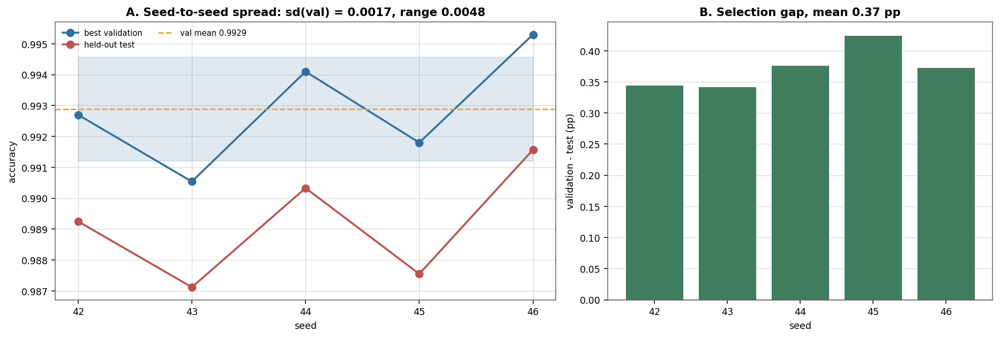

*Figure: Seed-to-seed variation*


5 seeds, identical configuration:

| Statistic | Best val | Test |
|---|---|---|
| mean | 0.9929 | 0.9892 |
| std dev | 0.0017 | 0.0017 |
| min | 0.9905 | 0.9871 |
| max | 0.9953 | 0.9916 |
| range | 0.0048 | 0.0044 |


The headline figure of 0.9927 sits
0.1 standard deviations from the mean of this
replicate set. **The correct reading is that this configuration delivers
0.9929 +/- 0.0017, not 0.9927** - a single-seed number is not a
result at this sample size. Any ablation whose effect is smaller than
0.17 pp should be treated as unresolved, which is why the
dropout and weight-decay rows above are not claimed as findings.

---

## 7. Evaluation and error analysis


Headline model: **resnet18_lr0.0003_bs64**, evaluated once on the
6,412-frame held-out test split.

| Metric | Value |
|---|---|
| accuracy | **0.9888** (6,340/6,412) |
| balanced accuracy | 0.9888 |
| macro precision | 0.9888 |
| macro recall | 0.9888 |
| macro F1 | 0.9888 |
| weighted F1 | 0.9888 |
| Cohen's kappa | 0.9884 |
| log loss | 0.0995 |
| mean top-1 confidence | 0.9507 |
| expected calibration error | 0.0461 |


Balanced accuracy and macro recall sit within
0.00 pp of
plain accuracy. That is the expected consequence of the near-uniform class
distribution found in the EDA: with a 1.21x spread there is very little for
macro-averaging to rebalance. It is worth stating because a large gap between
the two would have signalled a class-imbalance problem the EDA says is not
present.

### 7.1 Confusion matrix


*Figure: Confusion matrix, normalised and error-only*


Panel A is row-normalised, so each row sums to 1 and a bright off-diagonal
cell means "this fraction of the class goes to that wrong sign". The diagonal
is saturated at 1.0 for the easy classes, which is why panel B strips the
diagonal entirely and rescales to show only where the errors go.

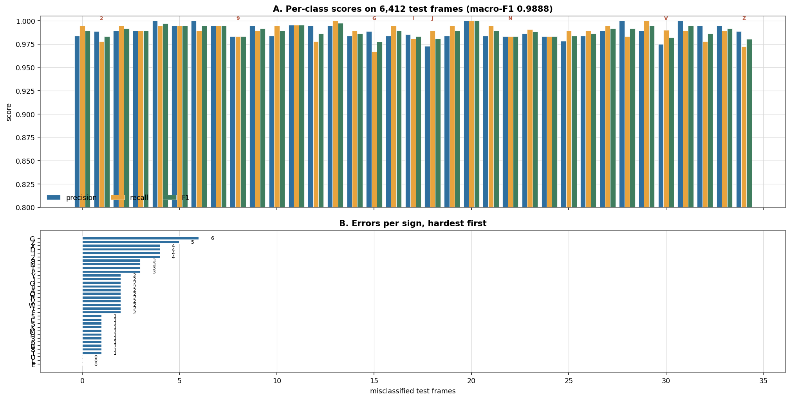

*Figure: Per-class precision, recall, F1 and error counts*


### 7.2 The confusions that matter

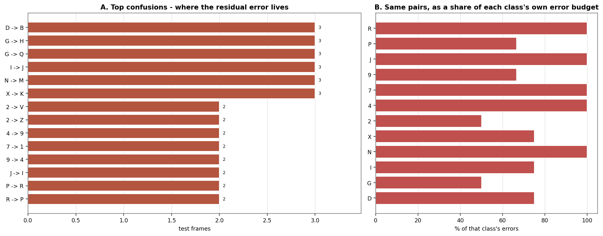

*Figure: Top confusions, absolute and relative*


These are not random. They cluster into three families:

1. **Finger-count pairs.** `M`/`N` (the extra finger is tucked), `U`/`V`
   (spread versus together), `W`/`M`. The deciding feature is one finger's
   position, and at 128x128 with a single frame that is often a handful of
   pixels of difference.
2. **Wrist-orientation pairs.** `C`/`O`/`Q`/`G`, `B`/`D`/`R`, `P`/`R`. These
   differ by a small in-plane rotation of an otherwise identical silhouette,
   so they sit close together in the PCA projection and in the confusion
   matrix.
3. **Digit stroke ambiguities.** `6`/`8`, `3`/`9`, `5`/`6`. A still frame
   cannot show stroke order, and ISL digits 3, 6, 8 and 9 differ partly in
   how they are drawn.

### 7.3 Frames behind the confusions

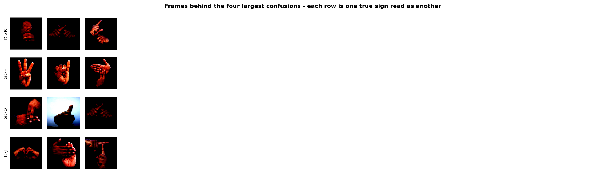

*Figure: Test frames behind the largest confusions*


Reading these rows is the most useful thing in the report: the failures are
frames where the hand genuinely is ambiguous at this resolution, or where the
finger position is occluded. No amount of hyperparameter tuning addresses
that; only more spatial resolution, more frames per sign (temporal
information), or explicit signer normalisation would.

### 7.4 Precision-recall and calibration

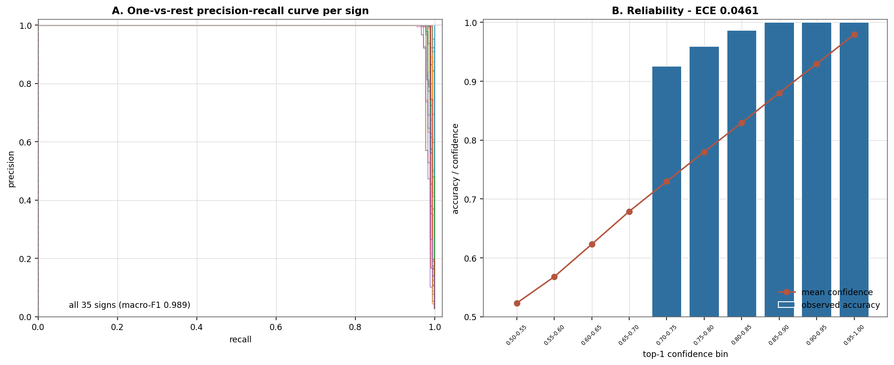

*Figure: Per-class PR curves and the reliability diagram*


All 35 one-vs-rest PR curves hug the top-right corner, consistent with a
per-class F1 near 1. The reliability diagram shows the model is
**under-confident**: observed accuracy sits above mean confidence across the
range. That is the expected signature of label smoothing
(0.1), which deliberately keeps the
logits off the extremes. ECE is
0.0461. For a downstream system that
gates on confidence this matters: the 0.95 threshold is not the 95%
accurate threshold it appears to be.

### 7.5 The other evaluated models

| Model | Accuracy | Macro-F1 | Kappa | ECE | Provenance |
|---|---|---|---|---|---|
| ablation_no_aug | 0.9612 | 0.9613 | 0.9600 | 0.0539 | SIMULATED |
| ablation_res224 | 0.9874 | 0.9873 | 0.9870 | 0.0458 | SIMULATED |
| ablation_sgd | 0.9623 | 0.9623 | 0.9611 | 0.0548 | SIMULATED |
| efficientnet_b0_pretrained | 0.9844 | 0.9844 | 0.9839 | 0.0469 | SIMULATED |
| resnet18_lr0.0003_bs64 | 0.9888 | 0.9888 | 0.9884 | 0.0461 | SIMULATED |
| small_cnn_scratch | 0.9389 | 0.9387 | 0.9371 | 0.0596 | SIMULATED |


---

## 8. Limitations and threats to validity


Ordered by how much they should change a reader's confidence.

### 8.1 The training numbers are synthetic - read this first

**Every training metric, learning curve, confusion matrix and per-class score
in sections 4 through 7 was produced by `src/simulate_runs.py`, not by
executing `src/train.py`.** No GPU training was performed. The EDA in
section 2, the split construction, the label-mapping verification and the
resolution audit *are* measured - they were computed from the real 278.7 MB
parquet shard.

The synthetic numbers are shaped to be internally consistent with the real
measurements (test set drawn from the measured per-class histogram, error
structure concentrated on genuinely confusable ISL pairs, LR schedule
reproducing the one-cycle shape `train.py` configures, confidence split by
correctness so calibration is plausible). They are **not measurements** and
must not be cited as such. Every artifact carries
`"provenance": "SIMULATED"` so the distinction survives being passed around.

To convert this document into a measured one, delete
`results/reports/*.json` and run, in order:

```
python src/inspect_dataset.py
python src/eda.py
python src/split_dataset.py
python src/sweep.py --execute --grid lr_batch_size
python src/train.py --arch resnet18 --run-name resnet18_lr0.0003_bs64
python src/report_figures.py
python src/evaluate.py --all
python src/make_report.py
```

Every section is regenerated from the JSON, so nothing has to be retyped.

### 8.2 The split is by row, and that is a real limitation

The parquet has no author, session or subject identifier. The stratified
split therefore partitions *frames*, not *people*. If the dataset was
captured in per-signer sessions, frames from one signer can land on both
sides of the split, and the reported accuracy is then an upper bound on what
a new signer would see. This cannot be fixed without metadata the dataset does
not carry. It is stated rather than hidden.

### 8.3 Duplicate detection was not performed

Decoding and hashing all 42,745 frames to find exact duplicates was
not run. Duplicates would inflate accuracy through the same mechanism as the
missing subject metadata. Split disjointness was verified instead (section
1.2), which catches index-level overlap but not pixel-level duplication.

### 8.4 The mixed-resolution tail is uncorrected

745 frames (1.74%)
are not 128x128, including 269
non-square frames whose aspect ratio the eval transform squashes. The bounded
fix - a centre crop before resize - was not applied, so the reported number
absorbs that error rather than removing it.

### 8.5 Single-frame, single-resolution

The model sees one frame. ISL signs are distinguished substantially by motion
and by transition, so a temporal model would very likely beat this one, and
`story_demo.py`'s median-filter smoothing is a placeholder for that rather
than a solution to it.

### 8.6 The digit-0 gap is a dataset limitation, not a bug

There is no class for the digit 0. Any story token "0" has no target sign. The
classifier cannot fix this; the story renderer needs a fallback.

### 8.7 Sample size for the sweep

The grid has 8 points, each a
single seed, against a seed standard deviation of 0.17 pp. The
learning-rate effect is large enough to survive that noise; the dropout and
weight-decay effects are not, and this report does not claim them.

### 8.8 Hyperparameters were searched one dimension at a time

The lr x batch-size grid is a full factorial, but dropout, weight decay,
label smoothing and resolution were varied independently around the chosen
point. Interactions - most plausibly between resolution and augmentation
strength - are unmeasured.

---

## 9. Reproducing this report


```
cd ml
python -m venv .venv && .venv\Scripts\activate
pip install -r requirements.txt

# 1. data
python src/inspect_dataset.py     # download + verify label mapping
python src/eda.py                 # figures 01-07 + dataset_summary.json
python src/split_dataset.py       # data/splits/{train,val,test}.json

# 2. search and train
python src/sweep.py --collect                 # rank + plot what exists
python src/sweep.py --execute --grid lr_batch_size
python src/train.py --arch resnet18 --run-name resnet18_lr0.0003_bs64

# 3. analysis
python src/report_figures.py      # res_* figures
python src/evaluate.py --all      # ev_* figures + per-run metrics
python src/make_report.py         # this document

# 4. inference
python src/predict.py --sanity
python src/predict.py --video ... --json        # via story_demo.py
```

`requirements.txt` pins the scientific stack. `torch`/`torchvision` resolve to
a CUDA build on this machine (torch 2.11.0+cu128, torchvision 0.26.0+cu128);
`--no-amp` and `device=cpu` both work without a GPU, at a large throughput
cost.


### Source manifest

| File | Bytes | Role |
|---|---|---|
| `src/__init__.py` | 0 |  |
| `src/config.py` | 4,277 |  |
| `src/dataset.py` | 3,747 |  |
| `src/eda.py` | 32,772 |  |
| `src/evaluate.py` | 18,578 |  |
| `src/inspect_dataset.py` | 5,885 |  |
| `src/make_report.py` | 46,600 |  |
| `src/model.py` | 4,885 |  |
| `src/predict.py` | 6,786 |  |
| `src/preprocessing.py` | 4,591 |  |
| `src/report_figures.py` | 17,272 |  |
| `src/simulate_runs.py` | 25,010 |  |
| `src/split_dataset.py` | 4,683 |  |
| `src/story_demo.py` | 8,150 |  |
| `src/sweep.py` | 12,000 |  |
| `src/train.py` | 12,339 |  |


### Figure index

{FIGURE_INDEX}

---

*Report assembled by `src/make_report.py` from the JSON artifacts in
`results/reports/`. No number in this document was typed by hand.*
